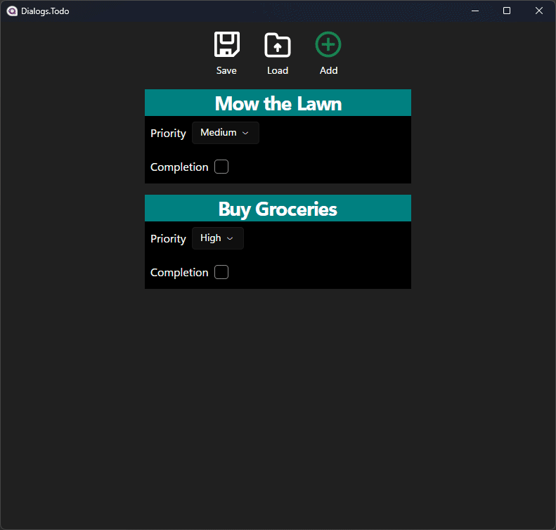
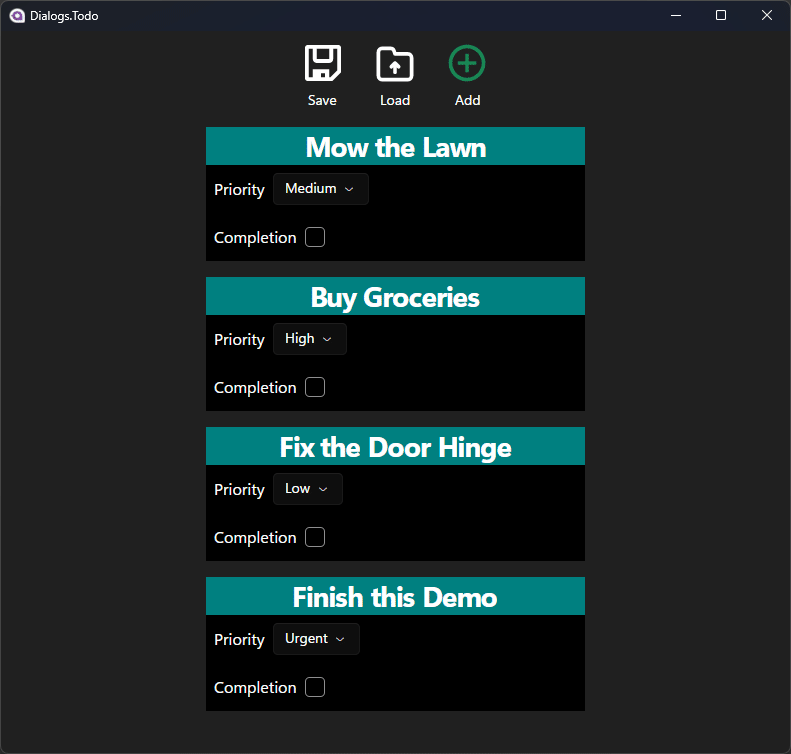

Basic Todo app that demonstrates several types of MVVM-friendly dialogs. It implements the interfaces from [Dialogs.Abstractions](/Dialogs.Abstractions) using [FluentAvalonia](https://github.com/amwx/FluentAvalonia) for hosting dialogs in-app.

## Add Todo Item

Shows a dialog request for complex data input. Also displays a message box to prove that nested dialogs can work in this system.

## Save, Load, and Edit Todos

Shows how to use open and save file picker dialogs in an MVVM-friendly way.

## Philosophy

MVVM shouldn't know about View concepts such as dialogs. Therefore, I've changed the terminology of common types to be more View-neutral. `DialogService` changes to `InteractionService` to denote some interaction with the user. Any interaction that can be cancelled by the user is a `Request`. Information passed to the user which they must acknowledge (usually with an Ok button) is called an `Alert` instead of a `MessageBox` with only an Ok button. When there are multiple choices, it's a `Prompt` instead of a `MessageBox` with Yes/No/Cancel buttons.

## Disclaimers

This approach to dialogs only works well for single window desktop applications. In multiple window settings, dialog services require `TopLevel` information to determine the correct parent for the dialog.

FluentAvalonia was used because it has easy integration with its `ContentDialog` and in-app overlay dialogs. An alternative would be [DialogHost.Avalonia](https://github.com/AvaloniaUtils/DialogHost.Avalonia) with some work to reimplement `ContentDialog`.
