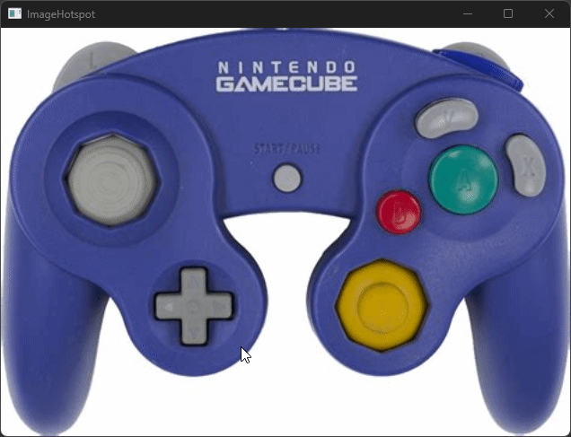



ImageHotspot demonstrates how to build interactive buttons onto a fixed size image.

## Problems and approach used:

### Image must be scalable while maintaining button locations

A Canvas of the same size of the Image is used. The Canvas contains the Image as well as all Buttons which are placed using absolute canvas coordinates.

Viewbox is used to scale the Canvas to the full window size.

### Button content can be of arbitrary shape

Ellipse and Rectangle are used for simpler shapes. Path is used as the Button child to define a shape that can have a outline and fill.

Inkscape was used to trace paths around the non-square, non-circular elements. One difficulty is that in Avalonia, the Buttons are translated in the Canvas. This means that child content inherits the Button position and not the Image. In Inkscape, you can fake this by applying a transform such that the Path is positioned at (0, 0) after tracing.

### Button hitboxes and outline should match the arbitrary shape

Button.Clip allows setting of a Geometry to clip rendering and hit testing. For circular elements, EllipseGeometry is used. For Path-based elements, Inkscape was used to create an offset Path from the original, about 2px, which was set as a PathGeometry. This allowed the outline to be drawn without partial clipping.

## Alternative approaches

Inkscape can create SVGs with images. It should be possible to draw paths, save as SVG, and load the SVG to create paths and visual elements from information within the SVG.