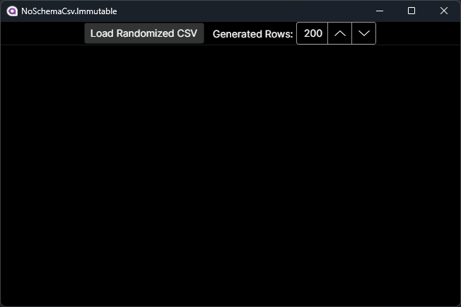

Demonstrates how to load CSV data without a known schema and display it within a `TreeDataGrid`.

### Major Concepts

* Defines a `CsvRecord` type backed by an array (`IReadOnlyList<string>`) for the unknown columns.
* Creates columns for `TreeDataGrid` and uses a lambda to index the array in `CsvRecord`.
* [Bogus](https://github.com/bchavez/Bogus) to generate random data for a CSV.
* [CsvHelper](https://github.com/JoshClose/CsvHelper) to read back the generated CSV.
* Basic DI container usage.

### Limitations

* The app is intended to be a viewer and the data is presumed to be immutable.
* No editing means that the loading process is less complex.
* Lack of column type detection means that numeric formatting can't be applied.
* Generating random data sets is slow and shouldn't be an indicator of real-world performance.
