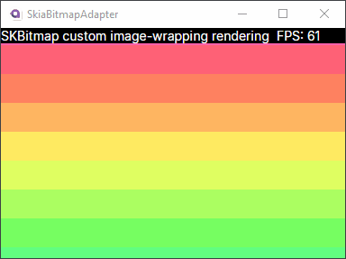

Demonstrates how to create a simple array of pixels and render it in Avalonia. Performs a simple image scrolling effect on the array to demonstrate scalability of the approach.

### Major Concepts in Approach
1. `TopLevel.RequestAnimationFrame` to be notified by Avalonia when the next animation update should happen.
2. `ICustomDrawOperation` to render the pixel data onto Avalonia's `SKCanvas`.
3. `SKBitmap.InstallPixels` to wrap the pixel data to prevent a copy into an Avalonia native type like `WriteableBitmap`.
4. `Dispatcher.UIThread.InvokeAsync(InvalidateVisual, DispatcherPriority.Background)` to continually render frames.

### Difficulties in Implementation

Several attempted approaches resulted in blocking of INPC updates to controls (eg. FPS display) where it would never update. Some approaches would update the FPS display or image 
when the window was resized. One approach caused double calling of the Render event resulting in 120 FPS instead of 60. Avalonia could really benefit from a control 
like `CanvasAnimatedControl` from UWP/Win2D that's more clear with its lifecycle and frame events.

### Shortcomings in Implementation

Lack of synchronization between writing to the pixel array and using it to render. This could be addressed in a real 
application with the addition of a backbuffer swap. Without this, the sample has conflicts where a partially 
dirty array is rendered, but it doesn't affect the specific visual much because the scrolling effect is so similar frame-to-frame.
