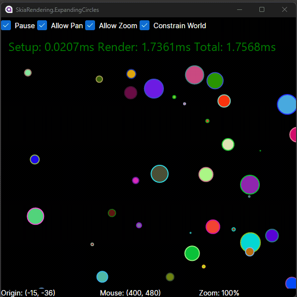

ExpandingCircles demonstrates the use of the following:

* [InfiniteCanvas control](../SkiaRendering.InfiniteCanvas)
* Hooking up Pointer events to pan and zoom logic
* Using RenderTrigger.Continuous to update state each frame
* Using RenderTrigger.Invalidation to render only when visual state is known to have changed
* Picking objects via Pointer events

Controls:
* Left Click: Add or Remove Circle under Pointer
* Right Click: Expand Circle
* Middle Click: Hold and move to pan
* Mouse Wheel: Zoom In/Out

(Screenshot recorded at 15fps to reduce image size)