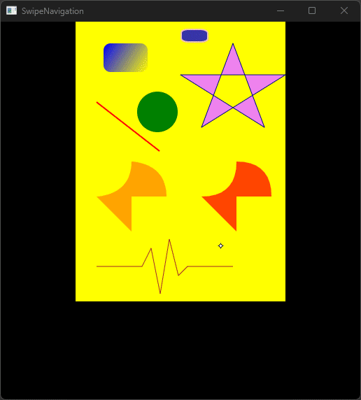

Demonstrates how to implement basic page swipe navigation similar to mobile.

## SwipeGestureRecognizer

Implements swipe gestures across an entire page. Allows customizing which directions can be swiped, the threshold distance of a valid swipe, and sends events with delta information of ongoing and completed swipes.

## TransitioningPageControl

Manages a collection of `Children` views (cached) and allows navigation left/right between them. Performs the animations using compositor.

Supports: Stylus and left/right arrow keys. Should support a touch device, but untested.

Very simplistic child management compared to other collection controls which often are generated via `ItemsSource`. Will maintain two items maximum in the logical and visual trees.

## Miscellany

Page contents are from Avalonia's `ControlCatalog`.
