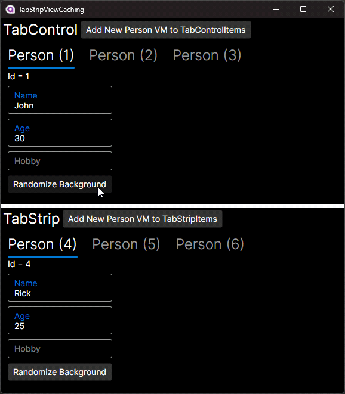

Demonstrates how to use TabStrip and how to cache and preserve Views

## TabStripViewCaching

`TabControl` (as of Avalonia 11.3.0) has issues regarding View recycling which causes state to be discarded when switching tabs. This is detrimental to tab UX in many cases, especially regarding scrolling.

`TabStrip` offers a minimal set of functionality that lends itself well to deeper customization. Specifically, `TabStrip` does not manage the creation or showing of its selected item, only the headers.

## Implementation

`TabStrip.ItemsSource` has a collection binded from the ViewModel. Some code-behind is used to:

1. Create a View for the tab's ViewModel
2. Manage a cache of Views that reflect the ViewModel's collection of `TabViewModel`s by subscribing to the `CollectionChanged` event
3. Properly initialize and account for selection

This code can be packaged together into a derived `TabStrip`.

## Result

The capture below shows that top `TabControl` loses View state when switching tabs despite preserving the ViewModel state.

