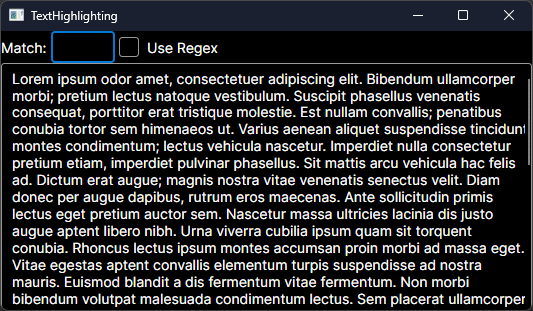

Demonstrates basic text highlighting with plain text or regex patterns. Caching of highlight ranges was implemented so that pattern matching doesn't reoccur on any render invalidation. Mostly at proof-of-concept phase as a base to create a better implementation.

## TextHighlightBlock

 `TextHighlightBlock` is a custom control derived from `SelectableTextBlock` so that selection is also supported.

Ideas on the approach came from a [discussion](https://github.com/AvaloniaUI/Avalonia/discussions/15879#discussioncomment-9635630) with @JouriM2 and the Avalonia `SelectableTextBlock` implementation.

## TextHighlightBox

`TextHighlightBox` is a custom control derived from `TextBox`. Implementation details are as follows:

1. The default `TextPresenter` was replaced with a derived `HighlightingTextPresenter`.
2. `TextPresenter.CreateLayoutText` was overridden to create `textStyleOverrides` for each highlighted phrase and between each highlighted phrase. Most of the implementation is from the original `TextPresenter`.
3. `TextPresenter.InvalidateTextLayout` is used to force an update when the highlight ranges have changed.
4. A new `ControlTheme` copied from `TextBox` was made so that `HighlightingTextPresenter` was used.

Ideas from this [discussion](https://github.com/AvaloniaUI/Avalonia/discussions/17077) which led to [AppSuiteBase's SyntaxHighlightingTextBox](https://github.com/carina-studio/AppSuiteBase/blob/master/SyntaxHighlighting/Controls/SyntaxHighlightingTextBox.cs) and some troubleshooting ideas from [Avalonia.SpellChecker](https://github.com/GustavoHennig/Avalonia.SpellChecker).
