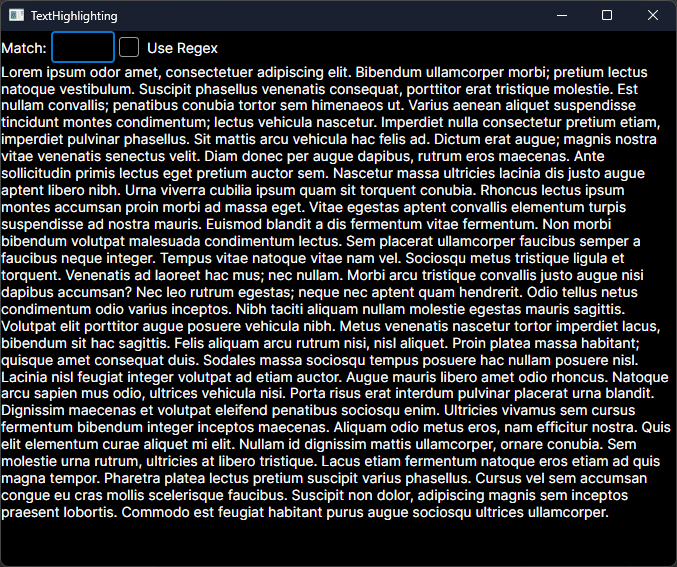

Demonstrates basic text highlighting with plain text or regex patterns. `TextHighlightBlock` is a custom control derived from `SelectableTextBlock` so that selection is also supported. Caching of highlight ranges was implemented so that pattern matching doesn't reoccur on any render invalidation.

Ideas on the approach came from a [discussion](https://github.com/AvaloniaUI/Avalonia/discussions/15879#discussioncomment-9635630) with @JouriM2 and the Avalonia `SelectableTextBlock` implementation.
