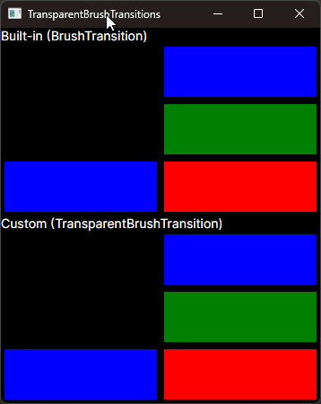

Demonstrates how to implement custom transitions in Avalonia using `InterpolatingTransitionBase<T>`.

## TransparentBrushTransition

Avalonia has a flaw when transitioning between `Transparent` (white transparent, #00FFFFFF) when using dark themed controls. This custom transition (only for `ISolidColorBrush`) won't interpolate color channels when a `Transparent` brush is used. Instead, `TransparentBrushTransition` will interpolate the alpha channel only and preserve the color channels from the non-transparent color. When neither color is `Transparent`, the behavior is the same as `BrushTransition` with full color interpolation in gamma-corrected sRGB space.

The following example demonstrates the transition flaw (top) and the fixed behavior with `TransparentBrushTransition` (bottom). The same flaw isn't present when using a light theme. The remaining 4 transitions are visually equal, but provided to prove they work for black-transparent (#00000000) and opaque color transitions.

## Miscellany

`LerpHelpers` were aggregated from the Avalonia source code and are necessary to use `TransparentBrushTransition`.

An alternative is to animate the `Opacity` member that all `IBrush` have.
